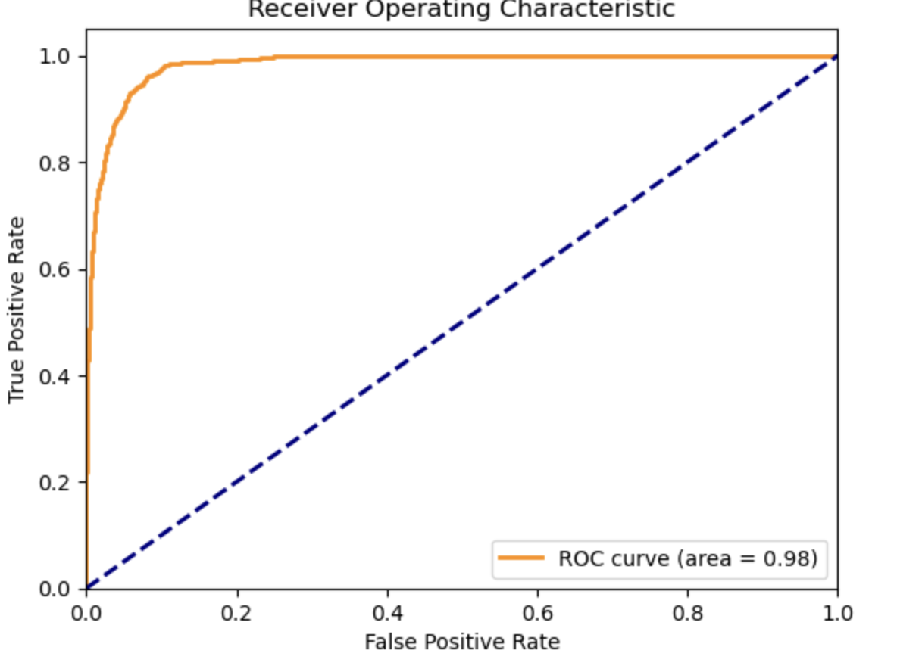
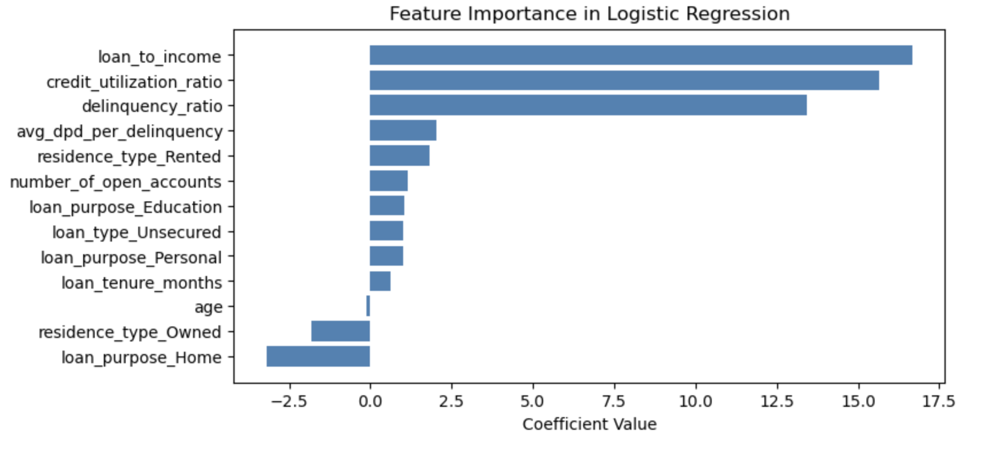

# Credit Risk Model for Lauki Finance

A collaborative project between **Lauki Finance** (an NBFC based in India) and **AtliQ AI** to develop a robust and interpretable **credit risk model**. This model categorizes loan applications based on default probability using demographic, financial, and credit bureau inputs. The solution includes a user-friendly **Streamlit application** and supports monitoring and MLOps integration.

---

## 🚀 Project Highlights

- **Credit Scorecard** based on CIBIL-like risk bands: *Poor, Average, Good, Excellent*
- **Logistic Regression** selected as the final model for deployment
- **XGBoost** and **Logistic Regression** models evaluated and optimized using **Optuna**
- **Streamlit-based UI** for real-time credit risk assessment
- **Model evaluation** via KS-statistic, AUC, Gini coefficient, and Rank Ordering

---

## 📊 Model Selection Summary

### 🔍 Attempt 1: XGBoost with RandomizedSearchCV
- **Macro F1-score**: `0.87`
- **AUC**: `0.95`
- **Best Hyperparameters**:
  - `max_depth`: 10, `eta`: 0.258, `scale_pos_weight`: 5.98, etc.
- **Observations**: Strong performance, especially on recall

### 🔍 Attempt 2: Logistic Regression with SMOTE-Tomek + Optuna Tuning
- **Macro F1-score**: `0.83`
- **AUC**: `0.9837`
- **Gini Coefficient**: `0.9674`
- **KS Statistic**: `85.98%` (excellent rank ordering)
- **Best Hyperparameters**:
  - `C`: 1.869, `solver`: 'saga', `tol`: 3.66e-06
- **Why Chosen?** Higher precision, greater interpretability, and business-aligned explainability

---

## 🧠 Final Model Evaluation

| Metric         | Value        |
|----------------|--------------|
| AUC            | 0.9837       |
| Gini Coefficient | 0.9674     |
| KS Statistic   | 85.98% (Decile 8) |
| Accuracy       | 93%          |
| Precision (1)  | 0.56         |
| Recall (1)     | 0.94         |

### 📈 Decile-wise Rank Ordering
- **Top Decile** (Decile 9): 72% default rate
- **Middle Deciles**: Noticeable drop in event rates
- **Bottom Deciles**: 0% default rate

---

## 🖥️ Streamlit Application

A user-friendly interface built using **Streamlit**, enabling loan officers to:
- Input borrower demographics, financials, and bureau scores
- Get real-time prediction of default probability and risk band
- View model explanation and rank scores

---

## 📦 Deliverables

- ✅ Finalized **Logistic Regression** model (exported as `joblib` or `pickle`)
- ✅ Streamlit UI application for production
- ✅ Evaluation metrics and visualizations (ROC, Decile Table, Feature Importance)
- ✅ Documentation for deployment, monitoring, and retraining

---

## 🛠️ Tools & Technologies

- Python (Pandas, NumPy, Scikit-learn)
- XGBoost
- Optuna for Hyperparameter Optimization
- Imbalanced-learn (SMOTE-Tomek)
- Streamlit
- Matplotlib / Seaborn for visualizations

---

---

## 🗓️ Timeline

- **Phase 1** – Model Development + Streamlit UI: 2 months
- **Phase 2** – MLOps & Production Monitoring: Post-trial phase

---

## 📌 Future Work

- Integrate monitoring tools (like MLflow or Prometheus)
- Enable **Straight Through Processing (STP)** for low-risk applications
- Automate periodic retraining based on drift detection

---

## 📎 Screenshots

>   
> *ROC-AUC = 0.98*

>   
> *Top drivers influencing credit default*

---

## 🤝 Authors & Partners

**Client**: Lauki Finance  
**Development Partner**: AtliQ AI  
**Lead Contributor**: *Dinesh Kumar Raju Kattunga*

---

## 📜 License

This project is licensed under the [MIT License](LICENSE).

